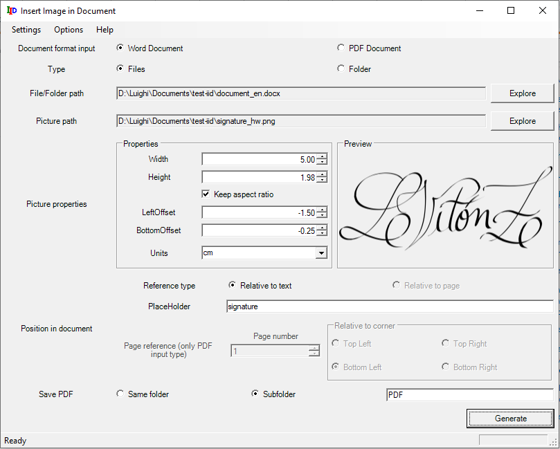

# Insert image in Document

## About

This is an open-source software developed to automate the insertion of images in a set of MS Word / PDF documents. It could be useful to insert a signature to various documents at a specific position in them.

The software has the option to select a specific list of MS Word / PDF documents, or a folder which contains those documents and insert the image to all of them. It also provides options to resize the image in different units of measurement and specify the relative position respect to a placeholder in the document (for example, the reference for the signature) or to a corner in a specific page (only for PDF documents). In addition to this, the software exports the document with the image inserted to a PDF file which may be created in the same folder  as the original document (only for Word documents) or in a subfolder.

## License

Copyright 2021 Luighi Vitón-Zorrilla

Licensed under the Apache License, Version 2.0 (the "License"); you may not use this file except in compliance with the License. You may obtain a copy of the License at

 http://www.apache.org/licenses/LICENSE-2.0

Unless required by applicable law or agreed to in writing, software distributed under the License is distributed on an "AS IS" BASIS, WITHOUT WARRANTIES OR CONDITIONS OF ANY KIND, either express or implied. See the License for the specific language governing permissions and limitations under the License.

## Download

The download links can be found at the Download section in the Documentation page ([EN](~/userdocs/en/index.md)|[ES](~/userdocs/en/index.md)).

- [Download page (EN)](~/userdocs/en/download.md) 

- [Página de descarga (ES)](~/userdocs/es/download.md) 